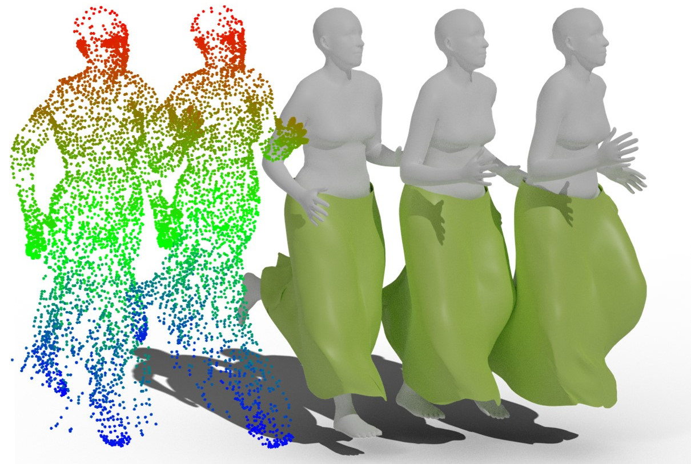

# Garment4D
[[PDF]](https://papers.nips.cc/paper/2021/file/eb160de1de89d9058fcb0b968dbbbd68-Paper.pdf)  |  [[OpenReview]](https://openreview.net/forum?id=aF60hOEwHP)  |  [[Project Page]](https://hongfz16.github.io/projects/Garment4D.html)

## Overview
This is the codebase for our NeurIPS 2021 paper *Garment4D: Garment Reconstruction from Point Cloud Sequences*.



For further information, please contact [Fangzhou Hong](mailto:fangzhouhong820@gmail.com).

## News
- **2021-12** Code release!
- **2021-09** Garment4D is accepted to NeurIPS 2021.

## Getting Started
Please checkout the `scripts` folder for the training scripts. We currently support three types of garments i.e. skirts, Tshirts and Trousers. Take skirts training as an example, please run the `seg_pca_skirt2.sh` first for the canonical garment reconstruction and then run the `seg_pca_lbs_skirt2.sh` for the posed garment reconstruction.

## TODO
- [ ] Instructions for setting up python environments.
- [ ] Data to run the code.
- [ ] Pre-trained models.

## Citation
If you find our work useful in your research, please consider citing the following papers:
```
@inproceedings{
    hong2021garmentd,
    title={Garment4D: Garment Reconstruction from Point Cloud Sequences},
    author={Fangzhou Hong and Liang Pan and Zhongang Cai and Ziwei Liu},
    booktitle={Thirty-Fifth Conference on Neural Information Processing Systems},
    year={2021},
    url={https://openreview.net/forum?id=aF60hOEwHP}
}
```

## Acknowledgments
In our implementation, we refer to the following open-source databases:
- [PointNet2.PyTorch](https://github.com/sshaoshuai/Pointnet2.PyTorch)
- [pygcn](https://github.com/tkipf/pygcn)
- [smplx](https://github.com/vchoutas/smplx)
